# [ISA5810 DM2026] Lab 1 – Environment Setup

Hi everyone,

The lab material and assignment submission space on NTU COOL will be available starting **September 28 (Monday)** at **9:00 AM**.

The Lab tutorial videos will be launched on the [YouTube Channel](https://www.youtube.com/@NTHU_ISA5810_DataMining) before **September 28**.

We strongly recommend setting up the environment on your personal laptop **before** the lab session so you can follow along smoothly. If you run into issues, email the TAs or attend TA sessions on weekdays.

This guide has **two parts**:

| Part | When | Where you work |
|------|------|----------------|
| **Part A — Environment check** | **Now** (before or after Sept 28) | [DM2026-Lab1-Announcement](https://github.com/difersalest/DM2026-Lab1-Announcement.git) setup repo |
| **Part B — Lab work & submission** | **After** the main lab repo is announced | Your fork of **DM2026-Lab1-Exercise** (main lab repo) |

**Where to run the steps:** If the main lab repo is **not** released yet, do Part A in the folder where you cloned **DM2026-Lab1-Announcement**. Once **DM2026-Lab1-Exercise** is available, repeat the environment steps (Python, `uv sync`, API keys, Test-Env) in **that** repo’s root, then continue with Part B.

**How to run the lab:** **Local setup only** on your laptop with `uv` + Jupyter or VS Code/Cursor/Antigravity. The agentic notebooks require local Jupyter (chat widgets do not work in cloud notebook runtimes).

---

## System requirements

- **Git** and a **GitHub** account. [Tutorial on Git, GitHub and GitHub Desktop](https://youtu.be/8Dd7KRpKeaE?si=rFDI-PHYcDc5jWAn)
- **uv** (installs and manages **Python 3.11** and the project virtual environment)
- **Jupyter** (installed by `uv sync`; use VS Code/Cursor/Antigravity or `jupyter lab` in the browser). **IMPORTANT NOTE:** Using `Jupyter Lab` for the `Agentic Section` of the lab is extremely recommended over some bugs that have been observed with VS Code / Cursor / Antigravity when running the widget to chat with the agent.
- [VS Code](https://code.visualstudio.com/download?_exp_download=fb315fc982), [Cursor](https://cursor.com/download), or [Antigravity](https://antigravity.google/download/) (optional but convenient). Click in the links to download and install the software.

The course targets **Python 3.11** (any patch release — the exact build depends on your OS; see `uv python list`). The announcement repo includes `pyproject.toml`, `uv.lock`, `requirements.txt`, and `.python-version` (`3.11`) so **package** versions match ours; you do not need to match a specific patch number.

---

# Part A — Environment check (DM2026-Lab1-Announcement)

Do this in the **announcement** repo first, even before the main lab materials are released.

## A1. GitHub account and Git

Sign up: [https://github.com/](https://github.com/)

Install Git:

- **Windows:** [https://gitforwindows.org/](https://gitforwindows.org/)
- **Linux:** `sudo apt install git-all`
- **macOS:** `brew install git`

Verify and configure (use your GitHub username and email):

```bash
git --version
git config --global user.name "YOUR_USERNAME"
git config --global user.email "your_email@example.com"
```

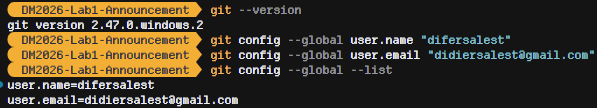

If you prefer a GUI (Graphic User Interface), [GitHub Desktop](https://desktop.github.com/) works too. [Check the GitHub Desktop tutorial in this video](https://youtu.be/8Dd7KRpKeaE?si=rFDI-PHYcDc5jWAn)

## A2. Install uv

In Terminal or PowerShell:

```bash
pip install uv
uv --version
```

On Windows you can also use the installer from [https://docs.astral.sh/uv/getting-started/installation/](https://docs.astral.sh/uv/getting-started/installation/).

## A3. Clone the announcement repo

Choose a folder for course work, then clone the **setup** repository (not the main lab repo yet):

```bash
cd <yourpath>
mkdir DM2026Labs
cd DM2026Labs
git clone https://github.com/difersalest/DM2026-Lab1-Announcement.git
cd DM2026-Lab1-Announcement
```


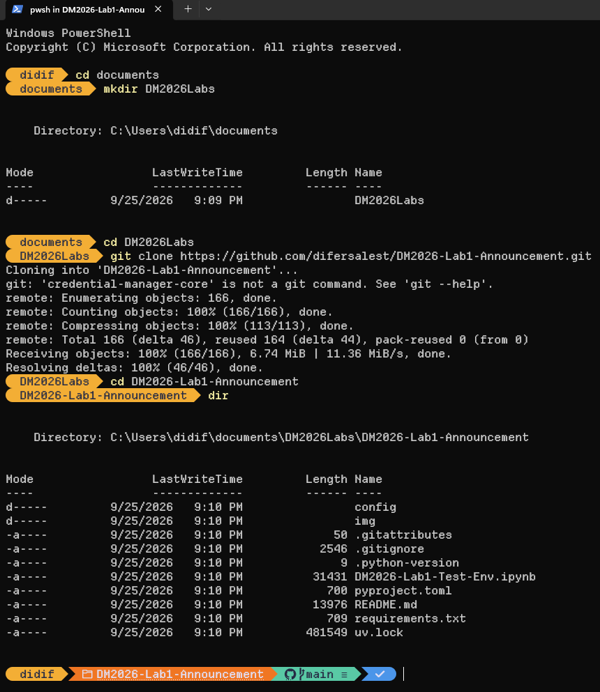

## A4. Python 3.11 and dependencies

From the **root** of `DM2026-Lab1-Announcement` (where `pyproject.toml`, `uv.lock`, and `.python-version` live):

Install a **3.11** interpreter once (uv downloads and manages it; the patch version is chosen for your platform):

```bash
uv python install 3.11
```

To see which 3.11 builds uv can install on your machine:

```bash
uv python list | findstr 3.11
```

On macOS/Linux, use `grep` instead of `findstr`:

```bash
uv python list | grep 3.11
```


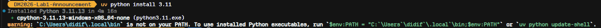

Create the virtual environment and install all packages at the pinned versions:

```bash
uv sync
```

`uv sync` reads `.python-version` (`3.11`) and uses the 3.11 interpreter you installed above. This creates `.venv` in the project folder and installs everything from `uv.lock`. **Let it finish with no errors** before opening any notebook. A partial install often breaks later notebooks (especially `ipywidgets` for the agent chat).


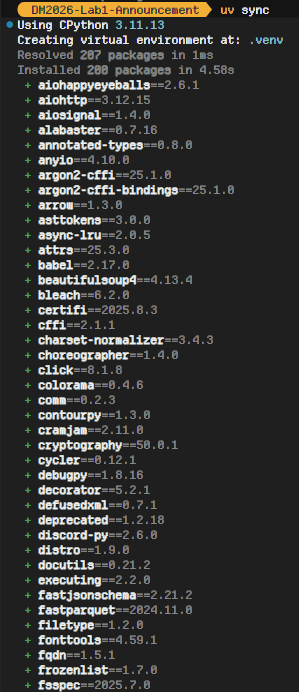

**Without uv (pip fallback only):** use any **Python 3.11.x** on your PATH, then from the repo root:

```bash
pip install -r requirements.txt
```

**Verify Python version:**

```bash
uv run python --version
```

Expected: `Python 3.11.x` (the patch number may differ from classmates on another OS — that is fine). It must **not** be 3.10 or 3.12+.

## A5. API keys (Groq and Google Gemini)

The agentic part of Lab 1 needs at least **one** LLM provider; we recommend **both** Groq and Gemini so you can use multi-provider fallback in the main repo (see its `README.md` later).

Neither provider requires a payment method for the free tier used in this course.

### Groq (recommended primary)

1. Go to [console.groq.com/keys](https://console.groq.com/keys), sign in, and click **Create API Key**.
2. Copy the key immediately — Groq only shows the full key once.
3. **One Groq key is enough.** Extra Groq keys under the same account do **not** increase your quota.

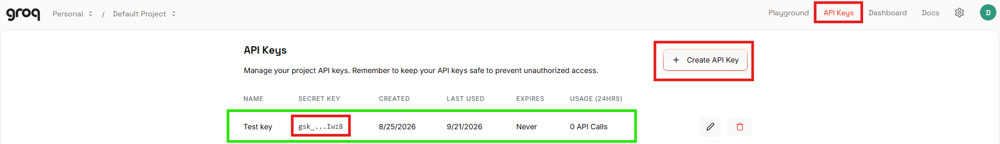

### Google Gemini

1. Go to [aistudio.google.com](https://aistudio.google.com), sign in with a Google account.
2. Click **Get API key** (upper right), then **Create API key**.
3. Optional: create keys in **separate Google Cloud projects** (`Pro 1`, `Pro 2`, …) if you want multiple keys for rotation later (`GOOGLE_API_KEY_1`, `_2`, … in `.env`).


### Create `config/.env`

From the repo root:

**macOS / Linux:**

```bash
cp config/.env.example config/.env
```

**Windows (Command Prompt):**

```bat
copy config\.env.example config\.env
```

Edit `config/.env` and paste your keys (replace the placeholder text):

```env
GROQ_API_KEY="your-actual-groq-key"
GOOGLE_API_KEY="your-actual-google-key"
```

Do **not** commit `config/.env` or share keys publicly.

<!-- TODO(image): config/.env with keys redacted or blurred -->


## A6. Register the Jupyter kernel

Still in the announcement repo root:

```bash
uv run python -m ipykernel install --user --name=dm2026-lab1 --display-name "Python (dm2026-lab1)"
```

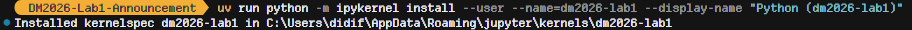

## A7. Open notebooks locally

### VS Code / Cursor / Antigravity

**IMPORTANT NOTE:** These programs are not so recommended due to some bugs observed in some environments when testing the Agent Chat Widget in the jupyter notebook, so it might also fail in your machine. You can try to use them, but it is under your own risk. `Jupyter Lab` has not presented any issues with the widget, so it is recommended to use it over this.

Open the folder of the repository from the `VS Code / Cursor / Antigravity` UI or execute the following commands in the terminal:

```bash
cd <path-to-DM2026-Lab1-Announcement>
code .
```

Open **`DM2026-Lab1-Test-Env.ipynb`** and choose kernel **Python (dm2026-lab1)** in the top-right corner.

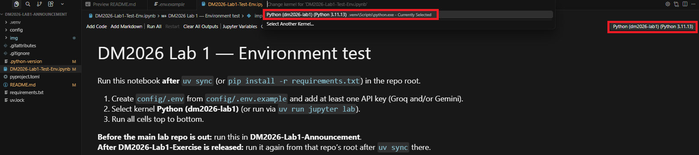

### JupyterLab in the browser (recommended over classic Notebook for widgets)

**IMPORTANT NOTE:** Using `Jupyter Lab` for the `Agentic Section` of the lab is extremely recommended over some bugs that have been observed with VS Code / Cursor / Antigravity when running the widget to chat with the agent.

```bash
cd <path-to-DM2026-Lab1-Announcement>
uv run jupyter lab
```

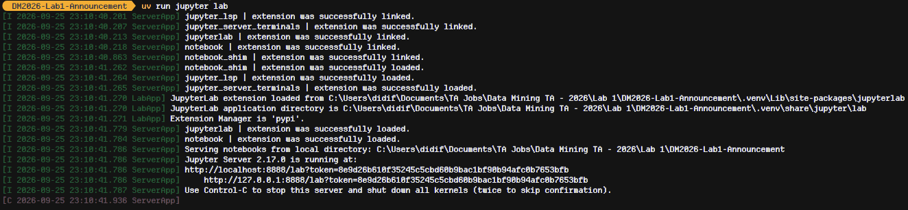

Open **`DM2026-Lab1-Test-Env.ipynb`** and select **Python (dm2026-lab1)** as the kernel.

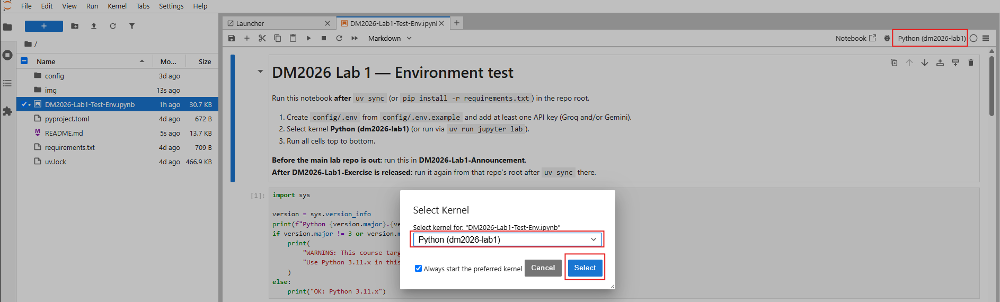

## A8. Test your environment

Open **`DM2026-Lab1-Test-Env.ipynb`**, run **all cells** in order, and fix any errors before the lab session.

The notebook checks:

- Python version and core libraries (pandas, scikit-learn, PAMI, umap, etc.)
- NLTK and a small 20-newsgroups download
- Groq and/or Gemini API connectivity (using `config/.env`)
- `ipywidgets` (needed later for the agent chat on **local** Jupyter)

The initial notebook provided already shows an example of how a successful environment setup looks like, first open it to take a look at it: 
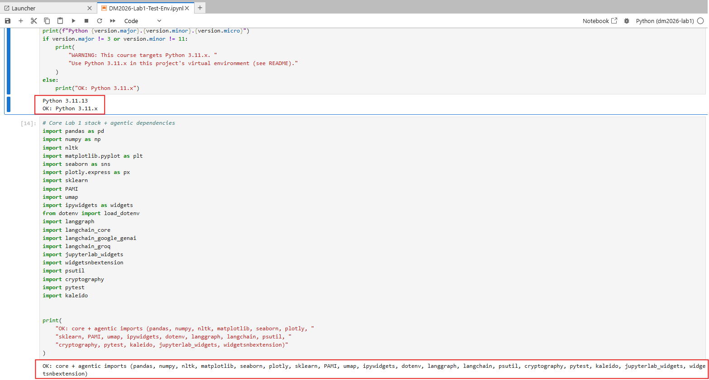

Run the cells in order and compare against our checklist if the environment works as expected:

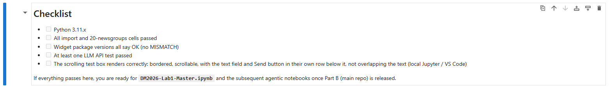

When **DM2026-Lab1-Exercise** is released, run the same notebook again from **that** repo’s root after `uv sync` there.

## Troubleshooting (Part A)

- **`uv sync` fails:** read the error, ensure you are in the repo root, run `uv python install 3.11` first, then `uv sync` again; try `uv lock` only if a TA tells you to — normally use the provided `uv.lock` as-is.
- **Wrong Python version:** run `uv python install 3.11`, delete `.venv` if needed, then `uv sync` from the repo root.
- **Wrong kernel:** the notebook must use **Python (dm2026-lab1)** from this project’s `.venv` (`uv run jupyter lab` or VS Code with that interpreter).
- **Chat widget frozen later in the lab:** re-run `uv sync` in the **same** repo you use for notebooks; check `ipywidgets` is installed.
- **`ModuleNotFoundError: PAMI`:** you are not using the project environment — activate via `uv run` or select the correct kernel.
- **API tests fail:** check `config/.env`, no placeholder text left, keys not expired; try the other provider.

Ask classmates or TAs before the lab if you are stuck.

Best regards,  
The TAs

---

# Part B — After DM2026-Lab1-Exercise is released

**Do not start Part B until the main lab repository is announced on NTU COOL.** Part A should already pass in the announcement repo; you will repeat the environment setup in the main repo, then do the lab and submit once.

## B1. Fork and clone the main lab repo

Go to the main lab repository on GitHub (link on NTU COOL when released starting **September 28 (Monday)** at **9:00 AM**), e.g. [DM2026-Lab1-Exercise](https://github.com/difersalest/DM2026-Lab1-Exercise).

Sign in, click **Fork** to copy it to your account.

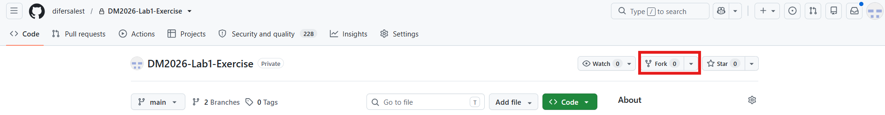

On your fork, click **Code** and copy the HTTPS URL.

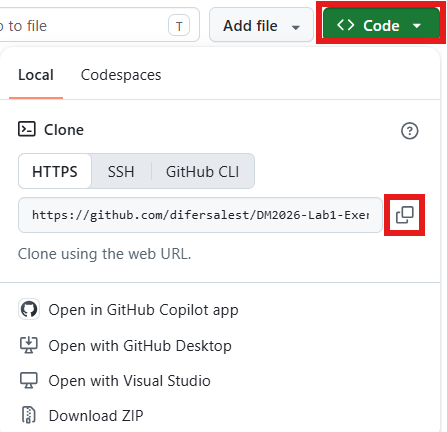

Clone **your** fork (not the TA’s upstream URL):

```bash
cd <yourpath>/DM2026Labs
git clone <your-fork-url>
cd DM2026-Lab1-Exercise
```

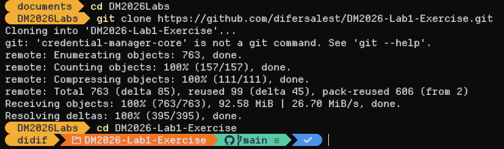

## B2. Environment in the main repo

From the **DM2026-Lab1-Exercise** root (same files as the announcement repo: `pyproject.toml`, `uv.lock`, etc.):

```bash
uv python install 3.11
uv sync
uv run python -m ipykernel install --user --name=dm2026-lab1 --display-name "Python (dm2026-lab1)"
```

Copy or recreate `config/.env` with your API keys. Run **`DM2026-Lab1-Test-Env.ipynb`** again here to confirm.

Read **`README.md`** in this repo for the agentic exercise: work through **`DM2026-Lab1-Master.ipynb`** first, then **`DM2026-Lab1-AgentDev.ipynb`**, **`DM2026-Lab1-AgenticPipeline.ipynb`**, and **`DM2026-Lab1-Homework.ipynb`** in that order.

## B3. Save progress with Git push

From the main repo root:

```bash
cd <path-to-your-DM2026-Lab1-Exercise>
git add .
git commit -m "your message"
git push
```

Use a meaningful commit message (e.g. `Finished Answering Master Questions 1–3`). Commit and push often.

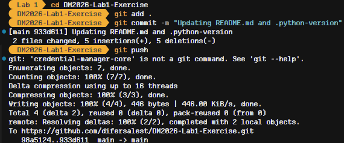

## B4. Submission (single deadline)

Submit on [NTU COOL](https://cool.ntu.edu.tw/login/portal) **before the deadline: October 19, 11:59 pm (Monday)**. There is **one** Lab 1 submission — include **all** of the following:

1. **GitHub repository link** — Copy and paste the link from your fork of **DM2026-Lab1-Exercise**, with your latest work pushed before the deadline (should include all the files cited below as well). Commits pushed after the deadline will have a **penalty** for the score. The **penalty** formula will be shared to you later on during the semester. 
2. **A .zip file:** Name the `.zip` file in the following format `{your_name_that_is_used_in_NTU_COOL}_{student_id}_files.zip`, check in NTU Cool how your name appears and use that to name the file in the specified format (e.g. `沙利葉_113065892_files.zip`). 
   
   2.1 **The Solved Lab 1 Master Questions Document (PDF)** — complete the Master Questions document (provided on the main repository as a `.docx` word template), export to **PDF**, and upload it. **IMPORTANT NOTE:** Change the name of the PDF in a similar fashion as the `.zip` file `{your_name_that_is_used_in_NTU_COOL}_{student_id}_solved_master_questions.pdf` (e.g. `沙利葉_113065892_solved_master_questions.pdf`). 

   2.2 **Agent conversation logs** — the three encrypted log files from the agentic notebooks (do **not** rename or edit them):
      - `session_logs/agent_dev_session.jsonl.enc`
      - `session_logs/agent_pipeline_session.jsonl.enc`
      - `session_logs/homework_session.jsonl.enc`

   2.3 **AgenticPipeline & Homework Reports** - the two generated markdowns `.md` under the `reports/` folder with the written reports, and the `plots/` folder that the reports will reference to show the images generated by the tools from the agentic pipeline.
      - `reports/{your_name_that_is_used_in_NTU_COOL}_{student_id}_agentic-pipeline_report.md`
      - `reports/{your_name_that_is_used_in_NTU_COOL}_{student_id}_homework_report.md`
      - `plots/` 

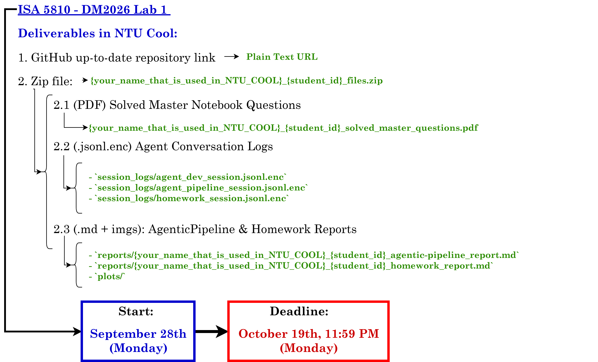

On the assignment page, upload or paste each required item in the **Lab 1** section as instructed on NTU COOL.

To copy your GitHub repo link: GitHub → profile → **Your repositories** → your fork → copy the browser URL.

## B5. Points Distribution:

1. **Solved Master Notebook Questions:** 40 pts.

2. **Solved Agent Dev Notebook:** 15 pts, graded from the encrypted conversation logs.

3. **Solved Agentic Pipeline Notebook:** Total 20 pts.

   3.1 **Guiding the Agent in the session:** 15 pts, graded from the encrypted conversation logs.

   3.2 **Agentic Pipeline Markdown Report:** 5 pts.

4. **Solved Homework Notebook:** Total 25 pts.

   4.1 **Guiding the Agent in the session:** 15 pts, graded from the encrypted conversation logs.

   4.2 **Homework Markdown Report:** 10 pts.

**`Total:` 100 pts.**

--- 

Again, as a reminder, **pushes made after the deadline will have points deducted from the final score according to a penalty formula.**

Good luck in the lab!
