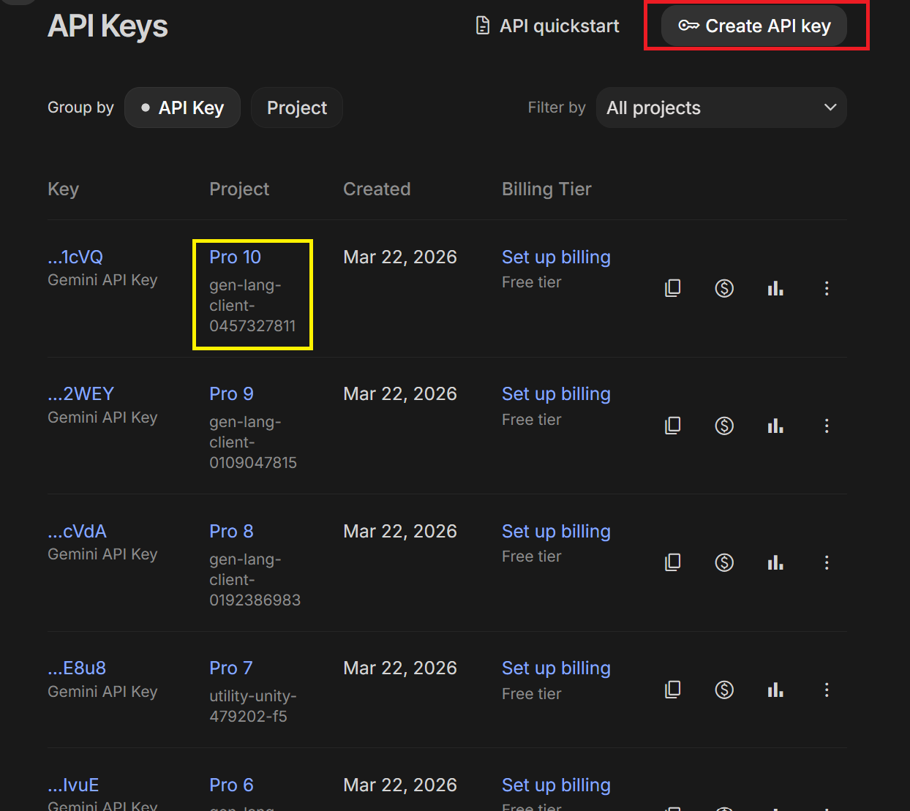

# [DM2026] Lab 1 – Environment Setup

Hi everyone,

The lab material and assignment submission space on NTU COOL will be available starting **September 28 (Monday)** at **9:00 AM**.

The Lab tutorial videos will be launched on the [YouTube Channel](https://www.youtube.com/@NTHU_ISA5810_DataMining) before **September 28**.

We strongly recommend setting up the environment on your personal laptop **before** the lab session so you can follow along smoothly. If you run into issues, email the TAs or attend TA sessions on weekdays.

This guide has **two parts**:

| Part | When | Where you work |
|------|------|----------------|
| **Part A — Environment check** | **Now** (before or after Sept 28) | [DM2026-Lab1-Announcement](https://github.com/difersalest/DM2026-Lab1-Announcement.git) setup repo |
| **Part B — Lab work & submission** | **After** the main lab repo is announced | Your fork of **DM2026-Lab1-Exercise** (main lab repo) |

**Where to run the steps:** If the main lab repo is **not** released yet, do Part A in the folder where you cloned **DM2026-Lab1-Announcement**. Once **DM2026-Lab1-Exercise** is available, repeat the environment steps (Python, `uv sync`, API keys, Test-Env) in **that** repo’s root, then continue with Part B.

**How to run the lab:** **Local setup (recommended)** on your laptop with `uv` + Jupyter or VS Code/Cursor/Antigravity. **Google Colab** is a limited fallback for checking packages and API keys only — the **agentic notebooks may require local Jupyter** (chat widgets do not work reliably on Colab).

---

## System requirements

- **Git** and a **GitHub** account
- **uv** (installs and manages Python **3.11.16** and the project virtual environment)
- **Jupyter** (installed by `uv sync`; use VS Code/Cursor or `jupyter lab` in the browser)
- [VS Code](https://code.visualstudio.com/download?_exp_download=fb315fc982), [Cursor](https://cursor.com/download), or [Antigravity](https://antigravity.google/download/) (optional but convenient). Click in the links to download and install the software.

The TAs develop and test on **Python 3.11.16**. The announcement repo includes `pyproject.toml`, `uv.lock`, `requirements.txt`, and `.python-version` so your versions match ours.

---

# Part A — Environment check (DM2026-Lab1-Announcement)

Do this in the **announcement** repo first, even before the main lab materials are released.

## A1. GitHub account and Git

Sign up: [https://github.com/](https://github.com/)

Install Git:

- **Windows:** [https://gitforwindows.org/](https://gitforwindows.org/)
- **Linux:** `sudo apt install git-all`
- **macOS:** `brew install git`

Verify and configure (use your GitHub username and email):

```bash
git --version
git config --global user.name "YOUR_USERNAME"
git config --global user.email "your_email@example.com"
```


If you prefer a GUI, [GitHub Desktop](https://desktop.github.com/) works too.

## A2. Install uv

In Terminal or PowerShell:

```bash
pip install uv
uv --version
```

On Windows you can also use the installer from [https://docs.astral.sh/uv/getting-started/installation/](https://docs.astral.sh/uv/getting-started/installation/).

## A3. Clone the announcement repo

Choose a folder for course work, then clone the **setup** repository (not the main lab repo yet):

```bash
cd <yourpath>
mkdir DM2026Labs
cd DM2026Labs
git clone https://github.com/difersalest/DM2026-Lab1-Announcement.git
cd DM2026-Lab1-Announcement
```

Replace `<yourpath>` with where you store your files.

<!-- TODO(image): Terminal showing git clone of DM2026-Lab1-Announcement and cd into the folder -->


## A4. Python 3.11.16 and dependencies

From the **root** of `DM2026-Lab1-Announcement` (where `pyproject.toml` and `uv.lock` live):

Install the Python interpreter once (uv downloads and manages it):

```bash
uv python install 3.11.16
```

<!-- TODO(image): uv python install 3.11.16 completing successfully -->


Create the virtual environment and install all packages at the pinned versions:

```bash
uv sync
```

This creates `.venv` in the project folder and installs everything from `uv.lock`. **Let it finish with no errors** before opening any notebook. A partial install often breaks later notebooks (especially `ipywidgets` for the agent chat).

<!-- TODO(image): uv sync finishing without errors -->


**Without uv (pip fallback only):** use Python 3.11.16, then from the repo root:

```bash
pip install -r requirements.txt
```

**Verify Python version:**

```bash
uv run python --version
```

Expected: `Python 3.11.16` (or another 3.11.x if `uv`'s available builds have moved on since this was written -- `uv python list` shows what it can actually install).

## A5. API keys (Groq and Google Gemini)

The agentic part of Lab 1 needs at least **one** LLM provider; we recommend **both** Groq and Gemini so you can use multi-provider fallback in the main repo (see its `README.md` later).

Neither provider requires a payment method for the free tier used in this course.

### Groq (recommended primary)

1. Go to [console.groq.com/keys](https://console.groq.com/keys), sign in, and click **Create API Key**.
2. Copy the key immediately — Groq only shows the full key once.
3. **One Groq key is enough.** Extra Groq keys under the same account do **not** increase your quota.

<!-- TODO(image): Groq console Create API Key (key value hidden) -->


### Google Gemini

1. Go to [aistudio.google.com](https://aistudio.google.com), sign in with a Google account.
2. Click **Get API key** (upper right), then **Create API key**.
3. Optional: create keys in **separate Google Cloud projects** (`Pro 1`, `Pro 2`, …) if you want multiple keys for rotation later (`GOOGLE_API_KEY_1`, `_2`, … in `.env`).



### Create `config/.env`

From the repo root:

**macOS / Linux:**

```bash
cp config/.env.example config/.env
```

**Windows (Command Prompt):**

```bat
copy config\.env.example config\.env
```

Edit `config/.env` and paste your keys (replace the placeholder text):

```env
GROQ_API_KEY="your-actual-groq-key"
GOOGLE_API_KEY="your-actual-google-key"
```

Do **not** commit `config/.env` or share keys publicly.

<!-- TODO(image): config/.env with keys redacted or blurred -->


## A6. Register the Jupyter kernel

Still in the announcement repo root:

```bash
uv run python -m ipykernel install --user --name=dm2026-lab1 --display-name "Python (dm2026-lab1)"
```

## A7. Open notebooks locally

### VS Code / Cursor

```bash
cd <path-to-DM2026-Lab1-Announcement>
code .
```

Open **`DM2026-Lab1-Test-Env.ipynb`** and choose kernel **Python (dm2026-lab1)** in the top-right corner.


### JupyterLab in the browser (recommended over classic Notebook for widgets)

```bash
cd <path-to-DM2026-Lab1-Announcement>
uv run jupyter lab
```


Open **`DM2026-Lab1-Test-Env.ipynb`** and select **Python (dm2026-lab1)** as the kernel.


## A8. Test your environment

Open **`DM2026-Lab1-Test-Env.ipynb`**, run **all cells** in order, and fix any errors before the lab session.

The notebook checks:

- Python version and core libraries (pandas, scikit-learn, PAMI, umap, etc.)
- NLTK and a small 20-newsgroups download
- Groq and/or Gemini API connectivity (using `config/.env`)
- `ipywidgets` (needed later for the agent chat on **local** Jupyter)

<!-- TODO(image): Test-Env notebook all cells passed -->


When **DM2026-Lab1-Exercise** is released, run the same notebook again from **that** repo’s root after `uv sync` there.

## A9. Google Colab (limited fallback)

Use Colab **only** if you cannot set up locally. You still need API keys.

**Colab is not supported for the agentic notebooks** (submitted conversation logs come from local runs). Use Colab to practice package imports and API smoke tests if needed.

1. Open [Google Colab](https://colab.research.google.com/).
2. Upload this repo or clone it in a notebook cell:

   ```python
   !git clone https://github.com/difersalest/DM2026-Lab1-Announcement.git
   %cd DM2026-Lab1-Announcement
   ```

<!-- TODO(image): Colab with repo cloned or folder uploaded -->


3. Install dependencies (Colab’s Python version may not be 3.11.16):

   ```python
   !pip install -r requirements.txt
   ```

4. Set API keys via **Secrets** (key icon in the left sidebar): add `GROQ_API_KEY` and/or `GOOGLE_API_KEY`, then in a cell:

   ```python
   import os
   from google.colab import userdata
   os.environ["GROQ_API_KEY"] = userdata.get("GROQ_API_KEY")
   os.environ["GOOGLE_API_KEY"] = userdata.get("GOOGLE_API_KEY")
   ```

<!-- TODO(image): Colab Secrets with key names visible, values hidden -->


5. Open `DM2026-Lab1-Test-Env.ipynb` from the cloned folder and run cells. The **ipywidgets** cell may fail or look broken on Colab — that is expected; use local Jupyter for the full lab.

## Troubleshooting (Part A)

- **`uv sync` fails:** read the error, ensure you are in the repo root, try `uv lock` only if a TA tells you to — normally use the provided `uv.lock` as-is.
- **Wrong kernel:** the notebook must use **Python (dm2026-lab1)** from this project’s `.venv` (`uv run jupyter lab` or VS Code with that interpreter).
- **Chat widget frozen later in the lab:** re-run `uv sync` in the **same** repo you use for notebooks; check `ipywidgets` is installed.
- **`ModuleNotFoundError: PAMI`:** you are not using the project environment — activate via `uv run` or select the correct kernel.
- **API tests fail:** check `config/.env`, no placeholder text left, keys not expired; try the other provider.

Ask classmates or TAs before the lab if you are stuck.

Best regards,  
The TAs

---

# Part B — After DM2026-Lab1-Exercise is released

**Do not start Part B until the main lab repository is announced on NTU COOL.** Part A should already pass in the announcement repo; you will repeat the environment setup in the main repo, then do the lab and submit once.

## B1. Fork and clone the main lab repo

Go to the main lab repository on GitHub (link on NTU COOL when released), e.g. [DM2026-Lab1-Exercise](https://github.com/leoson-wu/DM2026-Lab1-Exercise).

Sign in, click **Fork** to copy it to your account.


On your fork, click **Code** and copy the HTTPS URL.


Clone **your** fork (not the TA’s upstream URL):

```bash
cd <yourpath>/DM2026Labs
git clone <your-fork-url>
cd DM2026-Lab1-Exercise
```


## B2. Environment in the main repo

From the **DM2026-Lab1-Exercise** root (same files as the announcement repo: `pyproject.toml`, `uv.lock`, etc.):

```bash
uv python install 3.11.16
uv sync
uv run python -m ipykernel install --user --name=dm2026-lab1 --display-name "Python (dm2026-lab1)"
```

Copy or recreate `config/.env` with your API keys. Run **`DM2026-Lab1-Test-Env.ipynb`** again here to confirm.

Read **`README.md`** in this repo for the agentic exercise: work through **`DM2026-Lab1-Master.ipynb`** first, then **`DM2026-Lab1-AgentDev.ipynb`**, **`DM2026-Lab1-AgenticPipeline.ipynb`**, and **`DM2026-Lab1-Homework.ipynb`** in that order.

## B3. Save progress with Git push

From the main repo root:

```bash
cd <path-to-your-DM2026-Lab1-Exercise>
git add .
git commit -m "your message"
git push
```

Use a meaningful commit message (e.g. `Finished Answering Master Questions 1–3`). Commit and push often.


## B4. Submission (single deadline)

Submit on [NTU COOL](https://cool.ntu.edu.tw/login/portal) **before the deadline: October 19, 11:59 pm (Monday)**. There is **one** Lab 1 submission — include **all** of the following:

1. **GitHub repository link** — your fork of **DM2026-Lab1-Exercise**, with your latest work pushed before the deadline. Commits pushed after the deadline will have a **penalty** for the score. The **penalty** formula will be shared to you later on during the semester.

2. **Lab 1 Master Questions (PDF)** — complete the Master Questions document (provided on the main repository as a Word template), export to **PDF**, and upload it.

3. **Agent conversation logs** — the three encrypted log files from the agentic notebooks (do **not** rename or edit them):
   - `session_logs/agent_dev_session.jsonl.enc`
   - `session_logs/agent_pipeline_session.jsonl.enc`
   - `session_logs/homework_session.jsonl.enc`


On the assignment page, upload or paste each required item in the **Lab 1** section as instructed on NTU COOL.

To copy your GitHub repo link: GitHub → profile → **Your repositories** → your fork → copy the browser URL.

Again, **pushes made after the deadline will have points deducted from the final score according to a penalty formula.**

Good luck!
